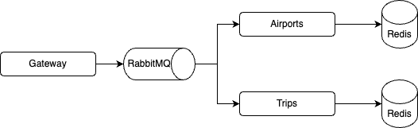

# Dockerfile

## Objetivo

El objetivo de la siguiente práctica es poner a prueba los conocimientos sobre como construir imágenes propias utilizando Dockerfiles y como orquestar múltiples contenedores utilizando docker compose. Para ello vamos a utilizar 3 aplicaciones implementadas en Python que implementan RPC a través de RabbitMQ y almacenan la información en Redis.



Se deberá:

- Definir un archivo Dockerfile para todos los servicios (`gateway`, `trips`, `airports`).
- Definir un docker-compose que permita levantar los 3 servicios mencionados junto con una instancia de RabbitMQ y una instancia de Redis por cada servicio de backend (`trips`, `airports`).

A continuación se detalla una guía de como realizar la tarea solicitada paso a paso. La solución implementada es la mínima para cumplir con los requisitos. A lo largo del camino se dejan comentarios sobre posibles mejoras. Investiguen las preguntas que haya por su cuenta. Al final podrán encontrar las "respuestas" a las mismas.

La guía consiste en:

1. Definir el Dockerfile para gateway
2. Comenzar con el docker-compose: gateway + Rabbit
3. Definir el Dockerfile para trips
4. Incorporar trips y redis al docker compose existente

## Gateway

### Definición de la imagen base

Lo primero que necesitamos para definir el Dockerfile de una aplicación es determinar la imagen base que vamos a utilizar. Para ello tenemos 2 opciones. 

- Por un lado podemos optar por utilizar una única imagen donde hagamos todo lo necesario para que la aplicación pueda correr.
- Por otro lado se puede utilizar una estrategia de [multi-stage](https://docs.docker.com/build/building/multi-stage/). Esta estrategia nos permite separar la generación de la imagen final en varias etapas. Es particularmente util en aplicaciones compiladas, donde la cantidad de dependencias necesarias para la generación del binario puede ser alta.

Dado que la aplicación en cuestión no necesita una compilación previa y para simplificar el proceso vamos a optar por la opción 1.

```Dockerfile
FROM python:3.11

...
```

### Código fuente y dependencias

En este caso, como es una aplicación Python podemos aprovechar la imagen oficial de Python. En particular podemos utilizar `python:3.11`, la cual contiene la ultima version de estable de python (3.11). En la pagina de Docker Hub de [Python](https://hub.docker.com/_/python) pueden encontrar todas las versiones y variantes disponibles. En el caso de Python existen las variantes `-alpine` y `-slim`. En este caso se eligió la "variante" principal ya que no tenemos limitaciones particulares de espacio que nos motiven a utilizar la version `-slim`. Tampoco se utilizo la variante `-alpine` ya que, ademas de no necesitarse el menor espacio, esta opción puede llegar a generar problemas de dependencias.

El siguiente paso es incorporar en la imagen todo el código y dependencias que nuestra aplicación necesite para correr. Teniendo en cuenta que estamos utilizando una aplicación Python esto implica copiar todo el código fuente (archivos `.py`) e instalar las dependencias utilizando `pip`.

```Dockerfile
...

COPY . .
RUN pip install -r requirements.txt

...
```

Estas instrucciones se encargan, por un lado, de copiar todo lo que se encuentre en el mismo directorio que el Dockerfile (`.`) en el contenedor y, por el otro, de instalar las dependencias declaradas dentro del `requirements.txt`.

> Donde están siendo copiados estos archivos dentro del contenedor? 
>
> Teniendo en cuenta el proceso de generación de imágenes y el cacheo de las capas, como podríamos modificar el Dockerfile para aprovechar el cacheo de las capas? Que beneficios nos daría esto?

### Configuración final

Una vez instaladas las dependencias y agregado el código fuente, ya podemos correr la aplicación. En particular esta aplicación debe ser ejecutada con el siguiente comando `nameko run --config config.yml gateway`.

```Dockerfile
...

CMD ["nameko", "run", "--config", "config.yml", "gateway"]
```

### Primera iteración del Dockerfle

Combinando los pasos mencionados hasta el momento tenemos el siguiente archivo como resultado:

```Dockerfile
FROM python:3.11

COPY . .

RUN pip install -r requirements.txt

CMD ["nameko", "run", "--config", "config.yml", "gateway"]
```

### Creación de Imagen y Contenedor

Para verificar el correcto funcionamiento deberemos convertir el Dockerfile en una imagen y luego generar un container a partir de la misma.

#### Build

Primero obtenemos el path de la carpeta que tiene el código de `gateway` (y donde debería estar el Dockerfile). Luego generamos la imagen utilizando `docker build -t gateway:v1 <PATH_GATEWAY>`. Lo que estamos haciendo es un build del Dockerfile que está en el directorio `<PATH_GATEWAY>` y estamos nombrando esta imagen como `gateway:v1`. En este caso `gateway` seria el nombre y `v1` la etiqueta, que identifica la primera versión de la misma. 

Podrán observar que al ejecutar el build, pip nos reta por estar corriéndolo con root y nos recomienda usar un venv. Si bien una parte del dominio de este problema es el ecosistema Python (no central a la materia), el mismo se ve afectado por al forma en la que Docker opera. Por lo tanto lo analizaremos mas adelante. 

> A modo de ejercicio teórico: Como podríamos hacer para que pip NO sea ejecutado por `root`?

#### Run

Una vez generada la imagen podemos generar un contenedor a partir de la misma, para ello bastaría con correr `docker run --rm gateway:v1`. En caso de que funcione podrán observar que la aplicación empieza a loggear errores, esto se debe a que la misma depende de otros servicios y de variables de entorno que todavía no definimos.

Hasta ahora logramos generar un Dockerfile muy simple que nos permite correr nuestra aplicación gateway dentro de un contenedor. El siguiente paso será levantar una cola de mensajes RabbitMQ para que la aplicación se pueda conectar. Para ello vamos a utilizar docker-compose.

## Docker-compose: primeros servicios.

Lo primero que hay que realizar con un archivo docker compose es definir la version del archivo compose. En este caso voy a utilizar la version mas reciente: `3.8`.

### Gateway: incorporación del servicio

Respecto a los servicios, vamos a comenzar con el gateway. Para ello vamos a hacer uso del Dockerfile que acabamos de definir. En un archivo llamado `docker-compose.yml` vamos a escribir

```yaml
version: "3.8"

services:
  gateway:
    build:
      context: ./gateway

...
```

Dentro de servicios vamos a declarar el servicio llamado `gateway`. El mismo sera generado a partir del Dockerfile ubicado en el contexto especificado `./gateway`. Si definimos este archivo dentro del directorio padre como `docker-compose.yaml` deberíamos tener todo lo necesario para levantar el primer contenedor de nuestro servicio. Para levantar lo que tenemos hasta ahora basta con ejecutar `docker compose up` desde el directorio padre (donde esta ubicado el archivo docker-compose.yml).

Si todo salió bien, podemos ver el mismo comportamiento que antes, la aplicación corre y loggea errores de conexión. El siguiente paso será solucionar este error.

### RabbitMQ: Incorporación de la cola de mensajes

En este caso nuestra aplicación depende de RabbitMQ para realizar los pedidos RPC. Para ello vamos a hacer uso de la imagen `rabbitmq:3-management`. Para la incorporación de este servicio basta con agregar:

```yaml
services:

  # Código anterior

  mq:
    image: rabbitmq:3-management
```

Una vez incorporada la cola de mensajes podemos levantar ambos contenedores y verificar que la aplicación se este conectando a a la cola.

### Sigue habiendo errores

Podrán observar que siguen habiendo problemas de conexión. Si investigamos un poco el código de la aplicación, en particular el archivo `config.yml`, podemos observar que la URI a ser utilizada para establecer la conexión depende de las siguientes variables de entorno `RABBIT_USER`, `RABBIT_PASSWORD`, `RABBIT_HOST` y `RABBIT_PORT`. Dentro de las opciones posibles para definirlas, voy a analizar tres que podríamos considerar:

- Hardcodear los valores dentro del archivo `config.yml`.
- Definir los valores de las variables dentro del Dockerfile utilizando la sentencia `ENV`.
- Definirlas a partir del docker-compose

Las primeras dos opciones tienen el problema de que los valores de las variables de entorno se están definiendo al momento de generar la imagen. Esto implica que las imágenes están configuradas de forma estática, dificultando su reutilización en distintos ambientes y adaptación a cambios en el contexto en se podrían llegar a utilizar. Esta práctica tampoco es recomendable por cuestiones de seguridad. En un ambiente productivo es de vital importancia que los secretos/contraseñas sean lo mas privado posibles. Por lo tanto, desacoplar los mismos del código fuente de la aplicación es altamente recomendable. Por otro lado la 3era opción nos permite que los valores sean definidos cuando se crea el contenedor.

Dentro compose tenemos 2 opciones para manejar las variables de entorno, como valores literales o utilizando archivos que contengan las variables. En este caso voy a optar por el uso de archivos. Esto me permite simplificar el archivo compose y agrupar las variables en un mismo lugar. Desde la seguridad, otro beneficio importante de esta opción es desacoplar la declaración del docker compose (el cual probablemente quiera versionar) de los valores de las variables que seguramente son sensibles.

Después de tanta charla...

Primero vamos a definir un archivo llamado `gateway.env` en el directorio padre. Si este código es parte de un repositorio, agregaríamos este archivo al [.gitignore](https://git-scm.com/docs/gitignore)

```conf
RABBIT_USER=guest
RABBIT_PASSWORD=guest
RABBIT_HOST=mq
RABBIT_PORT=5672
```

y agregar un nuevo valor al servicio previamente declarado:

```yaml
services:
  gateway:
    ...
    env_file:
      - gateway.env
    ...
```

Tanto `RABBIT_USER`, `RABBIT_PASSWORD` y `RABBIT_PORT` contienen los valores default. Los mismo pueden ser encontrados en la [página de la imagen utilizada](https://hub.docker.com/_/rabbitmq).

Por otro lado `RABBIT_HOST` contiene el valor `mq`. Para no tener que trabajar con IPs podemos aprovechar la funcionalidad que nos ofrece Docker de definir registros DNS a partir de los nombres de los contenedor. En el caso de compose el nombre utilizado sera el definido como clave del servicio (`mq` en este caso). Esto es posible ya que [compose por defecto genera una red para ser utilizada por todos los contenedores que se declaren dentro del archivo](https://docs.docker.com/compose/networking/). 

Si volvemos a correr la aplicación podemos ver que esta vez si se conectó :D.

> Si observan todos los logs se puede ver que primero la aplicación falla por unos instantes hasta que la cola de mensajes levanta por completo. Cómo podemos hacer para que la aplicación espere a que la cola de mensajes (y otras posibles dependencias) estén listas y recién ahí empiece a correr?

Habiendo solucionado la conexión del gateway con la cola de mensajes, lo ultimo que queda pendiente es poder acceder a esta API. En este caso la aplicación levanta en el puerto `8000` del contenedor. Para poder accederlo desde fuera del contenedor basta con exponerlo en el host. Para ello habrá que agregar un nuevo valor al servicio gateway:

```yaml
services:
  gateway:
    ...
    ports:
      - 8000:8000
    ...
```

Podemos levantar de nuevo los contenedores y verificar que haya funcionado accediendo a `http://localhost:8000/ping`.

Con esto podemos dar por finalizada la configuración necesaria para levantar el gateway de forma exitosa.

## Trips (o Airports)

Para el siguiente paso vamos a definir el Dockerfile de uno de los servicios del back. En este caso ambos servicios son muy similares, el proceso sera muy similar para ambos, por lo tanto vamos analizar solo uno de los dos: Trips.

Teniendo en cuenta los pasos mencionados para la creación del gateway y, que la aplicación también es de tipo Python, podemos copiar el Dockerfile utilizado. La única consideración es ajustar el comando utilizado. En este caso el comando es `nameko run --config config.yml trips`.

Para verificar su funcionamiento podemos seguir los mismos pasos realizados para el gateway o seguir adelante y verificar directamente en el compose. Por simplicidad de la guía vamos a optar por la segunda.

## Docker-compose: Incorporación de los servicios del back

La incorporación del servicio trips es muy similar a lo realizado para gateway. En este caso la aplicación no expone puertos que queramos acceder desde afuera por lo tanto no vamos a utilizar la propiedad de `ports`. Respecto a la configuración de ambiente, como el servicio de trips va a ser accedido por el gateway via RabbitMQ, el mismo también debe ser capaz de conectarse a la cola de mensajes. Analizando el código de trips identificamos las mismas variables de entorno que utiliza el gateway. En mi caso voy a generar un nuevo archivo `trips.env` que contenga los mismo valores.

```yaml
services:
  ...
  trips:
    build:
      context: ./trips
    env_file:
      - trips.env
  ...
```

Podemos levantar de nuevo los contenedores y verificar que este funcionando todo. La primer buena señal seria que no haya logs de errores. Para profundizar podemos hacer un pedido a `http://localhost:8000/trip-ping`. Si esta corriendo tanto el `gateway`, `rabbit` y `trips` y ambos servicios se pudieron conectar a la la cola, el pedido debería responder exitosamente.

Para probar con airports usar `/airport-ping`.

Si queremos ver como todavía falta una pieza podemos hacer un `GET` a `/airport/<ID>`o `/trip/<ID>`. Deberíamos obtener un mensaje de error. Esto se debe a que el servicio esta intentando acceder a un Redis que no sabe donde esta y tampoco existe.

## Docker-compose: Redis

Cada uno de los servicios (trips, airports) tendrá su propio Redis. Para el mismo utilizaremos la imagen `redis:7-alpine`. Mantendremos la configuración default sin agregar nada.

```yaml
services:
  ...
  redis-trips:
    image: redis:7-alpine
  ...
```

Podríamos probar levantar todo de nuevo pero nos encontraríamos que todavía no funciona. Si bien levantamos la instancia de Redis, todavía hay que configurar el servicio en cuestión para que sepa donde esta y como conectarse. Para ello agregaremos a `trips.env` las siguientes variables

```conf
...
REDIS_HOST=redis-trips
REDIS_PORT=6379
```

Levantando todo podemos verificar que el servicio se haya conectado a redis accediendo a `http://localhost:8000/trip/<ID>` (o `/airport/<ID>`). Si todo funciona, por mas que le demos un ID inexistente, el pedido no va a fallar y devolverá un valor o un objeto vacío.

> Antes dijimos que los contenedores estaban todos en una misma red, esto implica que todos ven la instancia de redis. Como podemos hacer para que el servicio en cuestión sea el único que pueda acceder al contenedor del redis?

Completada la configuración de Trips faltaría replicarlo con Airport para tener toda la arquitectura funcionado.

Los endpoints faltantes para probar la aplicación son:

```
POST: /airport  {"airport": string}
POST: /trip     {"airport_from": string, "airport_to": string}
```

## Uso de los servicios

### Trips

```
curl --header "Content-Type: application/json" \
  --request POST \
  --data '{"airport_from":"EZE","airport_to":"CPC"}' \
  http://localhost:8000/trip
```

El pedido devolverá el ID asignado al viaje. Este ID podrá ser utilizado en consultas posteriores como:


```
curl http://localhost:8000/trip/<TRIP_ID>
```

### Airports

```
curl --header "Content-Type: application/json" \
  --request POST \
  --data '{"airport": "Ezeiza"}' \
  http://localhost:8000/airport
```

El pedido devolverá el ID asignado al aeropuerto. Este ID podrá ser utilizado en consultas posteriores como:

```
curl http://localhost:8000/airport/<AIRPORT_ID>
```

## Mejoras

### Destino de los archivos

> Donde están siendo copiados estos archivos dentro del contenedor? 

Por defecto los archivos y todas las comandos ejecutados dentro del Dockerfile son realizados desde `/`. Para modificar este comportamiento existe el comando `WORKDIR <PATH>`. Este nos permite modificar la carpeta de trabajo. Es implica que todos los paths relativos de nuestros comandos serán relativos a PATH.

Por lo general una buena practica es generar un directorio para poner el código fuente. Si usamos `/` sin mucho cuidado podríamos pisar partes del sistema y arriesgarnos a tener problemas.

Por lo tanto podríamos agregarle a nuestro Dockerfile lo siguiente

```Dockerfile
FROM python:3.11

RUN mkdir -p /usr/app
WORKDIR /usr/app

...
```

Todo lo que venga después de `WORKDIR` sera ejecutado dentro de `/usr/app`

### Separación en etapas

> Teniendo en cuenta el proceso de generación de imágenes y el cacheo de las capas, como podríamos modificar el Dockerfile para aprovechar el cacheo de las capas? Que beneficios nos daría esto?

Una funcionalidad interesante de Docker y la forma en la que se manejan las imágenes es la posibilidad de reutilizar capas ya creadas, ya sea por otras imágenes o distintas versiones de la imagen que esta siendo construida. El proceso de build es de arriba hacia abajo, desde el FROM hasta la ultima linea. Mientras no hayan cambiado las condiciones podemos reutilizar las capas. Cuando haya alguna modificación, se corta el cache y se construyen todas las capas siguientes. Una modificación puede ser causada por modificaciones en el Dockerfile o por cambios en los archivos siendo copiados a la imagen. Pueden encontrar mas información en la [documentación oficial de Docker](https://docs.docker.com/build/cache/).

Volviendo a nuestro caso, una pequeña modificación que podríamos hacer sobre nuestro Dockerfile para mejorar los tiempos de build y la cantidad de espacio en imágenes seria lo siguiente.

Convertir:

```Dockerfile
COPY . .
RUN pip install -r requirements.txt
```

En:

```Dockerfile
COPY requirements.txt .
RUN pip install -r requirements.txt

COPY . .
```

Este cambio afectara solo a trips y airports, ya que son los únicos que comparten requisitos.

Para analizar el impacto de este cambio se puede observar el proceso de build de las imágenes y ver como, partiendo de cero, la primera que se genere tendrá que descargar las dependencias. Cuando llegue la segunda, al momento de generar la capa asociada a `RUN pip install -r requirements.txt` se utilizara la capa ya creada (`CACHED`).

```
=> [trips_gateway internal] load build definition from Dockerfile                                                      0.5s
=> => transferring dockerfile: 225B                                                                                    0.0s
=> [trips_airports internal] load build definition from Dockerfile                                                     0.8s
=> => transferring dockerfile: 226B                                                                                    0.0s
=> [trips_trips internal] load build definition from Dockerfile                                                        0.9s
=> => transferring dockerfile: 223B                                                                                    0.0s
=> [trips_gateway internal] load .dockerignore                                                                         1.1s
=> => transferring context: 2B                                                                                         0.0s
=> [trips_trips internal] load .dockerignore                                                                           1.2s
=> => transferring context: 2B                                                                                         0.0s
=> [trips_airports internal] load .dockerignore                                                                        1.3s
=> => transferring context: 2B                                                                                         0.0s
=> [trips_airports internal] load metadata for docker.io/library/python:3.11                                           0.0s
=> CACHED [trips_airports 1/6] FROM docker.io/library/python:3.11                                                      0.0s
=> [trips_gateway internal] load build context                                                                         0.7s
=> => transferring context: 1.10kB                                                                                     0.0s
=> [trips_trips internal] load build context                                                                           0.8s
=> => transferring context: 732B                                                                                       0.0s
=> [trips_gateway 2/6] RUN mkdir -p /usr/apps                                                                             2.6s
=> [trips_airports internal] load build context                                                                        0.8s
=> => transferring context: 768B                                                                                       0.0s
=> [trips_trips 3/6] WORKDIR /usr/apps                                                                                 1.2s
=> [trips_gateway 4/6] COPY requirements.txt .                                                                         2.1s
=> [trips_trips 4/6] COPY requirements.txt .                                                                           1.9s
=> [trips_trips 5/6] RUN pip install -r requirements.txt                                                              23.8s
=> [trips_gateway 5/6] RUN pip install -r requirements.txt                                                            19.2s
=> [trips_gateway 6/6] COPY . .                                                                                        1.4s
=> [trips_airports] exporting to image                                                                                 4.4s
=> => exporting layers                                                                                                 1.6s
=> => writing image sha256:219a30347ebf7540af9af923c6b6b94df1d87c6a4d213c38d72a38f4c7b63bee                            0.0s
=> => naming to docker.io/library/trips_gateway                                                                        0.0s
=> => writing image sha256:57e7a2ed44eab1b87bfa34587fcff71d5a6c5dfd07eb352bf073fd8aa5ee4c97                            0.1s
=> => naming to docker.io/library/trips_trips                                                                          0.1s
=> => writing image sha256:bc51979f1e151fef3d7ee7e31fcd9c946dc574deb3ae40f1e676bfc325fdaf8c                            0.0s
=> => naming to docker.io/library/trips_airports                                                                       0.0s
=> CACHED [trips_airports 4/6] COPY requirements.txt .                                                                 0.0s
=> CACHED [trips_airports 5/6] RUN pip install -r requirements.txt                                                     0.0s
=> [trips_airports 6/6] COPY . .                                                                                       1.6s
=> [trips_trips 6/6] COPY . .                                                                                          1.4s
```

En este caso hice un build de las 3 imágenes utilizando `docker compose build`. Podemos observar como tuvo que ejecutar pip para trips y gateway pero, en el caso de airports, pudo aprovechar el cache.

Otra forma de observar como ambas imágenes comparten capas es inspeccionando la imagen generada. Ejecutando `docker inspect trips_airports:latest trips_trips:latest | jq '.[].RootFS'` obtenemos lo siguiente:

```json
{
  "Type": "layers",
  "Layers": [
    "sha256:ec09eb83ea031896df916feb3a61cefba9facf449c8a55d88667927538dca2b4",
    "sha256:053a1f71007ec7293dceb3f229446da4c36bad0d27116ab5324e1c7b61071eae",
    "sha256:a90e3914fb92b189ed9bbe543c4e4cc5be5bd3e7d221ef585405dd35b3e4db43",
    "sha256:5ab567b9150b948de4708a880cad7026665e7e0a227dea526cc3839eca4b2515",
    "sha256:d4514f8b2aac13e66dfc8b6e15aa2feb0d4ff942a192d9481f09b45e681ceb40",
    "sha256:5c563cc8b2164d65f7d80f9d61a7acf805965c54e7f3cb86f2478611351129a5",
    "sha256:13cf5de1dd974bb717b5020966a1fb15f523151d4d95fc3501ebee0c0859245c",
    "sha256:76ff57e73979c903ec8b4da08cb00e611967b49e44d97e9ba44f397d34eed755",
    "sha256:7db0b7dc960a3ef1453a774e4a788cbf00c3e81ddb662cd4d2dfc900ae163195",
    "sha256:9c06f5a0768ec468c7bca3d3326037a5998954c1d9aae401dd9dad5bac08c8c9",
    "sha256:5f70bf18a086007016e948b04aed3b82103a36bea41755b6cddfaf10ace3c6ef",
    "sha256:1c731ae359249dd327ba67b28d426b767586b81f9949561965571782fe46f188",
    "sha256:25f8ebd3cdf4208f934ca278dfe5db61d06915c8175173cbe117622aac20a1b6",
    "sha256:09871ec7ab833cc48213a1decc789ff0f677091b52e8e49c4372cca2225917e5"
  ]
}
{
  "Type": "layers",
  "Layers": [
    "sha256:ec09eb83ea031896df916feb3a61cefba9facf449c8a55d88667927538dca2b4",
    "sha256:053a1f71007ec7293dceb3f229446da4c36bad0d27116ab5324e1c7b61071eae",
    "sha256:a90e3914fb92b189ed9bbe543c4e4cc5be5bd3e7d221ef585405dd35b3e4db43",
    "sha256:5ab567b9150b948de4708a880cad7026665e7e0a227dea526cc3839eca4b2515",
    "sha256:d4514f8b2aac13e66dfc8b6e15aa2feb0d4ff942a192d9481f09b45e681ceb40",
    "sha256:5c563cc8b2164d65f7d80f9d61a7acf805965c54e7f3cb86f2478611351129a5",
    "sha256:13cf5de1dd974bb717b5020966a1fb15f523151d4d95fc3501ebee0c0859245c",
    "sha256:76ff57e73979c903ec8b4da08cb00e611967b49e44d97e9ba44f397d34eed755",
    "sha256:7db0b7dc960a3ef1453a774e4a788cbf00c3e81ddb662cd4d2dfc900ae163195",
    "sha256:9c06f5a0768ec468c7bca3d3326037a5998954c1d9aae401dd9dad5bac08c8c9",
    "sha256:5f70bf18a086007016e948b04aed3b82103a36bea41755b6cddfaf10ace3c6ef",
    "sha256:1c731ae359249dd327ba67b28d426b767586b81f9949561965571782fe46f188",
    "sha256:25f8ebd3cdf4208f934ca278dfe5db61d06915c8175173cbe117622aac20a1b6",
    "sha256:b2315dc6b95153bf96f673924128c6012356a0bb8003655d636e9f94aee92ca0"
  ]
}
```

Dentro de las capas que componen a las dos imágenes podemos ver que comparten todas a excepción de la última. Esta última capa es la asociada al código propio de cada aplicación, por lo tanto está bien que difiera.

### Problemas con pip

> A modo de ejercicio teórico: Como podríamos hacer para que pip NO sea ejecutado por `root`?

Al momento de ejecutar pip tenemos el problema que pip nos avisa que ejecutar pip como root no es recomendado, es mejor utilizar venv. Vamos a atacar este problema en dos partes. Primero vamos a incorporar el uso de venv (es una funcionalidad de python donde se genera un ambiente virtual. Permite aislar la aplicación de los módulos instalados en el sistema).

Vamos a cambiar el Dockerfile a lo siguiente:

```Dockerfile
FROM python:3.11

RUN mkdir -p /usr/app \
    && python -m venv /usr/app/.venv

ENV PATH="/usr/app/.venv/bin:$PATH"
WORKDIR /usr/app

COPY requirements.txt requirements.txt

RUN pip install --upgrade pip \
    && pip install -r requirements.txt

COPY . .

CMD ["nameko", "run", "--config", "config.yml", "gateway"]
```

En este caso estamos creando un venv con `python -m venv /usr/app/.venv` y actualizando el PATH con `ENV PATH="/usr/app/.venv/bin:$PATH"`. Luego, las próximas invocaciones a pip o python utilizaran la version definida en `/usr/app/.venv/bin`. También agregue para actualizar pip antes de hacer la instalación de las dependencias.

Si bien con estos cambios ya solucionamos los warnings de pip, todavía queda pendiente ver como ejecutar pip con otro usuario. En particular es de interés definir otros usuarios ya que el usuario default es root, lo cual implica riesgos de seguridad. [Security of Docker as it runs as root user](https://stackoverflow.com/a/19056603). [Do Not Run Dockerized Applications as Root](https://americanexpress.io/do-not-run-dockerized-applications-as-root/). [Get the evil out – don’t run containers as root](https://amazic.com/get-the-evil-out-dont-run-containers-as-root/).

Para ello vamos a definir un nuevo usuario, hacerlo dueño del directorio de trabajo y sus archivos y asignarlo como usuario default para ejecutar en el contenedor.

```Dockerfile
FROM python:3.11

RUN groupadd -g 999 python \
    && useradd -r -u 999 -g python python \
    && mkdir -p /usr/app \
    && python -m venv /usr/app/.venv \
    && chown -R python:python /usr/app 

ENV PATH="/usr/app/.venv/bin:$PATH"
ENV PIP_NO_CACHE_DIR=off
WORKDIR /usr/app
USER 999

COPY --chown=python:python requirements.txt requirements.txt
RUN pip install --upgrade pip && \
    pip install -r requirements.txt

COPY --chown=python:python . .

CMD ["nameko", "run", "--config", "config.yml", "gateway"]
```

Lo primero que hacemos es agregar el usuario (y grupo) que deseamos usar. Se suele definir a mano tanto el userID como el groupID (UID y GID) para que no tome valores asociados a usuarios del sistema. [Como se relacionan los usuarios dentro del contenedor con los del host](https://medium.com/@mccode/understanding-how-uid-and-gid-work-in-docker-containers-c37a01d01cf). Luego hacemos que el usuario sea el dueño de `/usr/app` y copiamos los archivos utilizando el nuevo usuario como propietario `COPY --chown=python:python`. Por ultimo, declaramos el nuevo usuario como ele usuario a ser utilizado por el resto de la ejecución `USER 999`.

Dado que definimos user antes de ejecutar pip, pip sera ejecutado utilizando le usuario 999. Como este usuario no tiene home y pip la utiliza para guardar cache, la ejecución del mismo falla. Para eso agregamos `ENV PIP_NO_CACHE_DIR=off`.

### Últimos retoques

Por último voy a agregar alunas sentencias mas al Dockerfile para darlo por terminado. Si bien no son cambios necesarios ayudan a documentar la imagen.

Los 3 cambios son:

- Incorporar labels con metadata relevante, en este caso quien es el que mantiene la imagen
- Informar que puertos son utilizados por la aplicación (solo gateway) para facilitar el uso de la aplicación y para permitir a docker run utilizar el flag `-P`.
- Definir un healthcheck en base al funcionamiento de la imagen

```Dockerfile
FROM python:3.11

LABEL maintainer="isagues@itba.edu.ar"

...

COPY --chown=python:python . .

EXPOSE 8000
HEALTHCHECK CMD curl -f http://localhost:8000/ping || exit 1

CMD ["nameko", "run", "--config", "config.yml", "gateway"]
```

Podemos verificar la presencia de los labels con `docker image inspect <IMAGEN> | jq '.[].Config.Labels'`, los puertos expuestos con `docker image inspect gateway:final | jq '.[].Config.ExposedPorts'`. Por otro lado, para verificar el funcionamiento del healthcheck es necesario convertir la imagen en un contenedor. Una vez que la imagen este corriendo, podemos utilizar docker ps (para usar la misma terminal habría que correr el container con -d) para verificar el estado del contenedor. Podemos ver que, en la columna de status, ademas del uptime se muestra el estado del contenedor. Los primeros 30s va a estar en el periodo de `starting`, luego aplicara el healthcheck, si todo sale bien dirá `healthy`.

### Dependencia entre servicios

> Si observan todos los logs se puede ver que primero la aplicación falla por unos instantes hasta que la cola de mensajes levanta por completo. Como podemos hacer para que la aplicación espere a que la cola de mensajes (y otras posibles dependencias) estén listas y recién ahi empiece a correr?

Lo que esta pasando es que la aplicación depende de RabbitMQ, en particular depende de que la misma este operativa. Para ello docker compose nos permite definir dependencias entre los servicios. En el caso del gateway podemos agregar que el mismo depende de la cola de mensajes.

```yaml
  gateway:
    ...
    depends_on:
      mq:
        condition: service_healthy
```

En este caso estamos diciendo que gateway necesita que `mq`este healthy. Para que esto funcione es necesario que mq tenga definido un healthcheck. En este caso, la imagen utilizada para `mq` no tiene uno definido por defecto. Para ello podemos agregar lo siguiente

```yaml
   mq:
    ...
    healthcheck:
      test: ["CMD", "rabbitmq-diagnostics", "-q", "ping"]
      interval: 5s
```

Con la incorporación de estos cambios podemos ver como ahora el gateway no intenta arrancar hasta que el healthcheck de `mq` pase y ahora gateway simplemente arranca.

Se puede realizar lo mismo con los demás servicios que hablan con rabbitMQ. Además, para los servicios que utilizan redis podemos incorporar esa dependencia también. Lo único que faltaría para que eso sea posible sería que redis cuente con un healthcheck.

```yaml
services:
  redis-trips:
    ...
    healthcheck:
      test: ["CMD", "redis-cli", "ping"]
      interval: 5s
```

### Segregación de servicios

> Antes dijimos que los contenedores estaban todos en una misma red, esto implica que todos ven la instancia de redis. Como podemos hacer para que el servicio en cuestión sea el único que pueda acceder al contenedor del redis?

El último cambio que tengo para proponer es la separación de los servicios, en particular, agruparlos en distintas redes disjuntas para que solo se vean los servicios que necesitan verse entre si.

En este caso, la principal aislación que vamos a realizar es asignar una red especifica para que cada servicio se comunique con su redis.

Para la creación de las redes agregamos:

```yaml
version: "3.8"

...

networks:
  airports:
    driver: bridge
    internal: true
  trips:
    driver: bridge
    internal: true
  mq:
    driver: bridge
    internal: true
```

Una vez definidas las redes hay que asignarle a cada servicio las redes que queremos que use.

```yaml
services:
  airports:
    ...
    networks:
      - airports
      - mq
  
  trips:
    ...
    networks:
      - trips
      - mq
  
  gateway:
    ...
    networks:
      - mq
      - default

  redis-airports:
    ...
    networks:
      - airports

  redis-trips:
    ...
    networks:
      - trips
  
  mq:
    ...
    networks:
      - mq
```