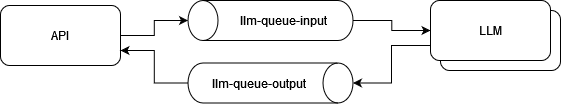
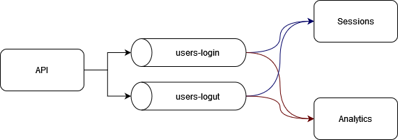

# Práctica 4 -Comunicación entre Servicios

A continuación se encuentran dos pequeños ejemplos de comunicación entre servicios haciendo uso de Kafka.

## Message Queue

### Ejecutar

Levantar los servicios: `docker compose up -d --build`

Logs de la API: `docker logs -f  async_api 2>&1 | grep -v 'INFO:'` 

Logs de los LLM:

- `docker logs -f async_llm1`
- `docker logs -f async_llm2`
- `docker logs -f async_llm3`

rafaga de pedidos: `for i in {1..30}; do curl "localhost:8000/chat/mensajeN__$i" ; done;`

## Publish Subscribe

### Ejecutar

Levantar los servicios: `docker compose up -d --build`

Logs de la API: `docker logs -f  async_api 2>&1 | grep -v 'INFO:'` 

Logs de los subscribers:

- `docker logs -f async_sessions`
- `docker logs -f async_analytics`

Pedidos

- `curl localhost:8000/login/pepe`
- `curl localhost:8000/logout/pepe`
