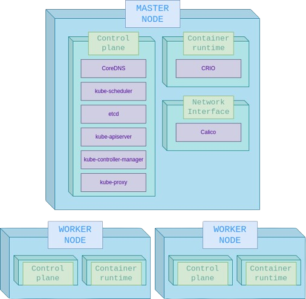

# Cluster setup

Vamos a levantar un cluster de kubernetes desde cero con kubeadm como deployment tool. Para que tengan una idea, miren el siguiente diagrama. Vamos a ir instalando y explicando cada componente.



> [!NOTE]  
> Crear un clúster con Kubeadm es un procedimiento más complejo que en Minikube, Kops u otros ofrecen. Kubeadm es la mejor solución cuando queres Kubernetes sin modificaciones y estás cómodo con una administración de sistema más práctica. Te permite personalizar componentes adicionales en tu entorno, como el tiempo de ejecución de contenedores subyacente.
>
> Nuestro objetivo al utilizar esta herramienta es mejorar nuestra comprensión de los componentes del sistema, de modo que si nos enfrentamos a problemas dentro del clúster, tengamos una idea más clara sobre si están relacionados con alguno de estos componentes.

# Levantamos las instancias

## Forma 1: Terraform
Si no tienen o no saben muy bien como usar terraform, usen la forma 2 que es simple de hacer.

- Terraform: [Sitio web oficial de Terraform](https://www.terraform.io/downloads.html).
- AWS CLI: [Instalación de AWS CLI](https://docs.aws.amazon.com/cli/latest/userguide/getting-started-install.html)
- Configurar credenciales de AWS CLI

Vamos a necesitar 3 hosts, un master y dos worker nodes, que cumplan con ciertos [requisitos para kubeadm](https://kubernetes.io/docs/setup/production-environment/tools/kubeadm/install-kubeadm/#before-you-begin).

Para levantar los nodos, primero actualizamos el path a una key (que la vamos a utilizar para hacer ssh a los nodos) y la region de aws en el archivo `empty_nodes_tf/locals.tf`. Luego,
navegamos a la carpeta `empty_nodes_tf` y corremos:

```bash
terraform init
terraform apply -auto-approve
```

Cuando termine, nos va a imprimir los comandos de ssh al master node y a los workers.

Si queremos obtener los comandos ssh otra vez, corremos `terraform output`.

## Forma 2: A manopla
La otra manera es levantarlo desde la consola de AWS. Este video muestra como levantar 3 nodos y accederlos por ssh: [enlace](https://youtu.be/muAhodvzTn0).

# Configuración
Lo primero que vamos a hacer va a ser configurar el nodo **master**. Entonces, entramos por ssh al nodo.

### 1. Configuración básica

Esto no es importante explicarlo pero sí ejecutarlo. Son algunos requerimientos básicos.

```shell
set -uxo pipefail

# disable swap
sudo swapoff -a

# keeps the swaf off during reboot
(crontab -l 2>/dev/null; echo "@reboot /sbin/swapoff -a") | crontab - || true
sudo apt-get update -y

# Create the .conf file to load the modules at bootup
cat <<EOF | sudo tee /etc/modules-load.d/k8s.conf
overlay
br_netfilter
EOF

sudo modprobe overlay
sudo modprobe br_netfilter

# sysctl params required by setup, params persist across reboots
cat <<EOF | sudo tee /etc/sysctl.d/k8s.conf
net.bridge.bridge-nf-call-iptables  = 1
net.bridge.bridge-nf-call-ip6tables = 1
net.ipv4.ip_forward                 = 1
EOF

sudo sysctl --system
```

## Container runtime

Kubernetes utiliza una [Container Runtime Interface (CRI)](https://kubernetes.io/docs/concepts/architecture/cri/) para el manejo de sus contenedores. En este caso, vamos a usar [CRIO](https://cri-o.io/) como runtime. CRIO es un implementación de ejecución de contenedores que cumple con la especificación de CRI. Proporciona una ejecución de contenedores más ligera y orientada a Kubernetes.

Otra opción es containerd, entre otros.

### 2. Instalación de CRIO

```bash
export CRIO_OS="xUbuntu_22.04"
export CRIO_VERSION="1.28"

cat <<EOF | sudo tee /etc/apt/sources.list.d/devel:kubic:libcontainers:stable.list
deb https://download.opensuse.org/repositories/devel:/kubic:/libcontainers:/stable/${CRIO_OS}/ /
EOF
cat <<EOF | sudo tee /etc/apt/sources.list.d/devel:kubic:libcontainers:stable:cri-o:${CRIO_VERSION}.list
deb http://download.opensuse.org/repositories/devel:/kubic:/libcontainers:/stable:/cri-o:/${CRIO_VERSION}/${CRIO_OS}/ /
EOF

curl -L https://download.opensuse.org/repositories/devel:kubic:libcontainers:stable:cri-o:${CRIO_VERSION}/${CRIO_OS}/Release.key | sudo apt-key --keyring /etc/apt/trusted.gpg.d/libcontainers.gpg add -
curl -L https://download.opensuse.org/repositories/devel:/kubic:/libcontainers:/stable/${CRIO_OS}/Release.key | sudo apt-key --keyring /etc/apt/trusted.gpg.d/libcontainers.gpg add -

sudo apt-get update
sudo apt-get install cri-o cri-o-runc cri-tools -y
```

### 3. Ejecutar crio

```bash
sudo systemctl daemon-reload
sudo systemctl enable crio --now
```

Ver información con: `sudo crictl info`.

## Control plane

Vamos a utilizar tres componentes principales en nuestro control plane:

- **kubeadm**: Se encarga de realizar tareas como el arranque de los componentes del plano de control, la configuración de la red y la unión de los nodos al clúster.

- **kubelet**: Se encarga de gestionar los contenedores en el nodo y garantizar que estén en un estado saludable. Se comunica con el plano de control para recibir instrucciones sobre qué contenedores se deben ejecutar.

- **kubectl**: Es la interfaz de línea de comandos para gestionar el clúster de Kubernetes.

> [!NOTE]  
> kubeadm no instalará ni gestionará kubelet ni kubectl, por lo que hay que asegurarse de que coincidan con la versión del plano de control de Kubernetes que deseas que kubeadm instale.

### Algunos de los recursos que trae el control plane:

- **kube-apiserver**: El servidor de API de Kubernetes, que expone la API de Kubernetes y gestiona las solicitudes de los clientes.
- **kube-controller-manager**: El administrador de controladores de Kubernetes, que ejecuta los controladores que regulan el estado del clúster y realizan acciones en respuesta a los cambios.
- **kube-scheduler**: El programador de Kubernetes, que decide en qué nodo se ejecutan los pods en función de las políticas y los recursos disponibles.
- **kube-proxy**: El proxy de Kubernetes, que se encarga de enrutar el tráfico de red a los pods correctos.
- **coredns/coredns**: El servidor DNS de Kubernetes, que resuelve los nombres de los servicios en direcciones IP.
- **pause**: Una imagen de contenedor mínima utilizada como plantilla para los contenedores de los pods.
- **etcd**: La base de datos distribuida de Kubernetes, que almacena el estado del clúster y garantiza la consistencia de los datos.

### 4. Instalación del control plane

Instalamos los paquetes necesarios para usar el repositorio apt de Kubernetes:

```bash
sudo apt-get update -y
sudo apt-get install -y apt-transport-https ca-certificates curl gpg

curl -fsSL https://pkgs.k8s.io/core:/stable:/v1.28/deb/Release.key | sudo gpg --dearmor -o /etc/apt/keyrings/kubernetes-1-28-apt-keyring.gpg
echo 'deb [signed-by=/etc/apt/keyrings/kubernetes-1-28-apt-keyring.gpg] https://pkgs.k8s.io/core:/stable:/v1.28/deb/ /' | sudo tee /etc/apt/sources.list.d/kubernetes-1.28.list

curl -fsSL https://pkgs.k8s.io/core:/stable:/v1.29/deb/Release.key | sudo gpg --dearmor -o /etc/apt/keyrings/kubernetes-1-29-apt-keyring.gpg
echo 'deb [signed-by=/etc/apt/keyrings/kubernetes-1-29-apt-keyring.gpg] https://pkgs.k8s.io/core:/stable:/v1.29/deb/ /' | sudo tee /etc/apt/sources.list.d/kubernetes-1.29.list
```

Instalamos kubelet, kubeadm y kubectl:

```bash
export KUBERNETES_VERSION="1.29.0-1.1"
sudo apt-get update -y
sudo apt-get install -y kubelet="${KUBERNETES_VERSION}" kubectl="${KUBERNETES_VERSION}" kubeadm="${KUBERNETES_VERSION}"
sudo apt-get update -y
sudo apt-mark hold kubelet kubeadm kubectl
```

### 5. Inicializamos el nodo master

```bash
# Pull required images
export NODE_NAME="master"
export POD_NETWORK_CIDR="192.168.0.0/16"

sudo kubeadm config images pull

sudo kubeadm init --node-name "${NODE_NAME}" --pod-network-cidr="${POD_NETWORK_CIDR}" --ignore-preflight-errors Swap --ignore-preflight-errors=DirAvailable--cert-dir

mkdir -p /home/ubuntu/.kube
sudo cp -i /etc/kubernetes/admin.conf /home/ubuntu/.kube/config
sudo chown ubuntu:ubuntu /home/ubuntu/.kube/config

```

## Container Network

Kubernetes utiliza [Container Network Interface (CNI)](https://www.cni.dev/docs/spec/#overview) plugin que le permite implementar el [Kubernetes network model](https://kubernetes.io/docs/concepts/services-networking/#the-kubernetes-network-model) (En términos generales, es la comunicación entre pods). La especificación CNI define:

- Un formato para que los administradores definan la configuración de red.
- Un protocolo para que los tiempos de ejecución de contenedores hagan solicitudes a los complementos de red.
- Un procedimiento para ejecutar complementos basados en una configuración suministrada.
- Un procedimiento para que los complementos deleguen funcionalidades a otros complementos.
- Tipos de datos para que los complementos devuelvan sus resultados al tiempo de ejecución.

En este caso utilizaremos la implementación Calico.

### 6. Instalación de Calico

Para instalar [Calico](https://docs.tigera.io/calico/latest/about/), ejecutamos:

```bash
kubectl --kubeconfig /home/ubuntu/.kube/config apply -f https://docs.projectcalico.org/manifests/calico.yaml
```

Podemos observar los pods de calico con `kubectl get pods -n kube-system`

## Worker node join

> [!NOTE]  
> De manera predeterminada, tu clúster no programará Pods en el nodo master por razones de seguridad.

Si queremos agregar más de un nodo, repetimos este proceso por cada nodo.

### 1. Obtenemos el comando join

Desde el master, corremos:

```shell
sudo kubeadm token create --print-join-command
```

Y nos va a imprimir algo así:

```shell
kubeadm join 172.31.82.1:6443 --token v3vmnw.pb51m4rjzf8c4u2k --discovery-token-ca-cert-hash sha256:b844b45ef07199012c0f3c665b713f7acc8dc6a6b8fd384d4bcdbb32b16dfffd
```

Este comando lo vamos a necesitar después.

### 2. Configuramos el worker node

Nos vamos al otro nodo y nos conectamos con ssh (recordemos que podemos obtener los comandos de ssh con `terraform output`).

Le vamos a instalar crio y el control plane. Es lo mismo que antes por lo que lo corremos todo junto:

```shell
set -uxo pipefail

# disable swap
sudo swapoff -a

# keeps the swaf off during reboot
(crontab -l 2>/dev/null; echo "@reboot /sbin/swapoff -a") | crontab - || true
sudo apt-get update -y

# Create the .conf file to load the modules at bootup
cat <<EOF | sudo tee /etc/modules-load.d/k8s.conf
overlay
br_netfilter
EOF

sudo modprobe overlay
sudo modprobe br_netfilter

# sysctl params required by setup, params persist across reboots
cat <<EOF | sudo tee /etc/sysctl.d/k8s.conf
net.bridge.bridge-nf-call-iptables  = 1
net.bridge.bridge-nf-call-ip6tables = 1
net.ipv4.ip_forward                 = 1
EOF

sudo sysctl --system

export CRIO_OS="xUbuntu_22.04"
export CRIO_VERSION="1.28"

cat <<EOF | sudo tee /etc/apt/sources.list.d/devel:kubic:libcontainers:stable.list
deb https://download.opensuse.org/repositories/devel:/kubic:/libcontainers:/stable/${CRIO_OS}/ /
EOF
cat <<EOF | sudo tee /etc/apt/sources.list.d/devel:kubic:libcontainers:stable:cri-o:${CRIO_VERSION}.list
deb http://download.opensuse.org/repositories/devel:/kubic:/libcontainers:/stable:/cri-o:/${CRIO_VERSION}/${CRIO_OS}/ /
EOF

curl -L https://download.opensuse.org/repositories/devel:kubic:libcontainers:stable:cri-o:${CRIO_VERSION}/${CRIO_OS}/Release.key | sudo apt-key --keyring /etc/apt/trusted.gpg.d/libcontainers.gpg add -
curl -L https://download.opensuse.org/repositories/devel:/kubic:/libcontainers:/stable/${CRIO_OS}/Release.key | sudo apt-key --keyring /etc/apt/trusted.gpg.d/libcontainers.gpg add -

sudo apt-get update
sudo apt-get install cri-o cri-o-runc cri-tools -y

sudo systemctl daemon-reload
sudo systemctl enable crio --now

sudo apt-get update -y
sudo apt-get install -y apt-transport-https ca-certificates curl gpg

curl -fsSL https://pkgs.k8s.io/core:/stable:/v1.28/deb/Release.key | sudo gpg --dearmor -o /etc/apt/keyrings/kubernetes-1-28-apt-keyring.gpg
echo 'deb [signed-by=/etc/apt/keyrings/kubernetes-1-28-apt-keyring.gpg] https://pkgs.k8s.io/core:/stable:/v1.28/deb/ /' | sudo tee /etc/apt/sources.list.d/kubernetes-1.28.list

curl -fsSL https://pkgs.k8s.io/core:/stable:/v1.29/deb/Release.key | sudo gpg --dearmor -o /etc/apt/keyrings/kubernetes-1-29-apt-keyring.gpg
echo 'deb [signed-by=/etc/apt/keyrings/kubernetes-1-29-apt-keyring.gpg] https://pkgs.k8s.io/core:/stable:/v1.29/deb/ /' | sudo tee /etc/apt/sources.list.d/kubernetes-1.29.list

export KUBERNETES_VERSION="1.29.0-1.1"
sudo apt-get update -y
sudo apt-get install -y kubelet="${KUBERNETES_VERSION}" kubectl="${KUBERNETES_VERSION}" kubeadm="${KUBERNETES_VERSION}"
sudo apt-get update -y
sudo apt-mark hold kubelet kubeadm kubectl
```

### 3. Cambiamos el nombre del host
Así los podemos identificar luego. Corremos:
```bash
sudo hostnamectl set-hostname node-1
```
Al segundo le ponemos `node-2`.

### 4. Nos unimos al cluster

Corremos **con sudo** el comando que obtuvimos en el paso 1.

### 5. Chequeamos que se agrego

Desde master corremos:

```shell
kubectl get nodes
```

Deberíamos obtener algo similar a:

```
NAME     STATUS   ROLES           AGE     VERSION
k8-two   Ready    <none>          23s     v1.29.0
master   Ready    control-plane   4m13s   v1.29.0
```

## Recorriendo el cluster

### Kubernetes API & kubectl

Kubectl es una herramienta de CLI utilizada para interactuar con el clúster de Kubernetes. Kubectl actúa como un cliente para la API de Kubernetes. Al ejecutar comandos con kubectl, estás enviando solicitudes a la API de Kubernetes. Estas solicitudes pueden incluir crear, leer, actualizar o eliminar recursos en el clúster, como pods, servicios, despliegues, entre otros. Kubectl envía las solicitudes a través de la red hacia el servidor de la API de Kubernetes.

La API de Kubernetes procesa las solicitudes y realiza las operaciones correspondientes en el clúster. Luego, envía una respuesta a kubectl, que la muestra en la salida de la línea de comandos. Esto permite a los usuarios interactuar con el clúster de Kubernetes y administrar sus aplicaciones y recursos de forma eficiente.

Si corremos:

```bash
cat /home/ubuntu/.kube/config
```

Obtenemos la configuración que utiliza kubectl:

```yaml
apiVersion: v1
clusters:
- cluster:
    certificate-authority-data: ...
    server: https://172.31.82.183:6443
  name: kubernetes
contexts:
- context:
    cluster: kubernetes
    user: kubernetes-admin
  name: kubernetes-admin@kubernetes
current-context: kubernetes-admin@kubernetes
kind: Config
preferences: {}
users:
- name: kubernetes-admin
  user:
    client-certificate-data: ...
    client-key-data: ...
```

Podemos ver que la API de kubernetes esta en https://172.31.82.183:6443. Es un servicio https que se encuentra en el puerto 6443.

Las credenciales de autenticación están basadas en certificados digitales:
```yaml
user:
    client-certificate-data: ...
    client-key-data: ...
```

### Kubernetes API groups

Existen numerosas APIs que nos permiten realizar varias acciones. Las mismas están segmentadas por grupos. El siguiente comando imprime todas y muestra el grupo y su versión (`group/version`):
```bash
kubectl api-versions
```
Cada una de estas APIs nos va a permitir interactuar con un conjunto de recursos distintos. Observemos los recursos de funcionalidades 'core':
```bash
kubectl api-resources --api-group ""
```
Los de networking:
```bash
kubectl api-resources --api-group "networking.k8s.io"
```
Los de deploy de aplicación
```bash
kubectl api-resources --api-group "apps"
```
Por ejemplo, nosotros cuando levantemos un ingress, internamente vamos a interactuar con la api networking.k8s.io. 
### Controllers
En Kubernetes, los controllers son ciclos de control que observan el estado del cluster, cuando es necesario realizan cambios. Cada controller intenta mantener el estado del cluster en el deseado o lo más cercano posible.

Cada controller en el clúster es un cliente de la API, y por lo tanto tiene su identidad y service account. Para ver todos los controllers se puede hacer:
```bash
kubectl get sa -n kube-system
```

### Namespaces
Un namespace en Kubernetes es una forma de organizar y dividir los recursos dentro de un clúster de Kubernetes.

Proporciona un ámbito aislado para los objetos, como los pods, los servicios y los volúmenes, lo que permite la segmentación lógica y la gestión más eficiente de los recursos. Esto permite que diferentes equipos o aplicaciones compartan el mismo clúster sin interferir entre sí.

Los espacios de nombres también ayudan a evitar colisiones de nombres, ya que los objetos en diferentes espacios de nombres pueden tener los mismos nombres sin conflictos.

Veamos los namespaces por defecto:

```bash
kubectl get namespaces
```
Kubernetes comienza con cuatro namespaces iniciales:

- **default**: Kubernetes incluye este namespace para que puedas empezar a usar tu nuevo clúster sin necesidad de crear primero un namespace.

- **kube-node-lease**: Este namespace contiene objetos Lease asociados con cada nodo. Los leases de nodo permiten que el kubelet envíe latidos para que el plano de control pueda detectar fallos en el nodo.

- **kube-public**: Este namespace es legible por todos los clientes (incluidos aquellos no autenticados). Este namespace está principalmente reservado para el uso del clúster, en caso de que algunos recursos deban ser visibles y legibles públicamente en todo el clúster. El aspecto público de este namespace es solo una convención, no un requisito.

- **kube-system**: El namespace para objetos creados por el sistema de Kubernetes.

Podemos correr comandos dentro de un namespace con el parámetro `-n <namespace>`. Por ejemplo, si corremos:
```bash
kubectl get pods -n default
```
Obtennemos `No resources found in default namespace.` pero si corremos:

```bash
kubectl get pods -n kube-system -o wide
```
El `-o wide` nos muestra un poco más de información como por ejemplo en que nodo están corriendo los pods. Obtenemos los pods creados por el sistema:
```
NAME                                       READY   STATUS    RESTARTS   AGE   IP             NODE     NOMINATED NODE   READINESS GATES
calico-kube-controllers-658d97c59c-tgxbl   1/1     Running   0          19m   10.85.0.3      master   <none>           <none>
calico-node-nq2dw                          1/1     Running   0          19m   172.31.87.82   master   <none>           <none>
coredns-76f75df574-446rn                   1/1     Running   0          19m   10.85.0.2      master   <none>           <none>
coredns-76f75df574-5pzxh                   1/1     Running   0          19m   10.85.0.4      master   <none>           <none>
etcd-master                                1/1     Running   0          19m   172.31.87.82   master   <none>           <none>
kube-apiserver-master                      1/1     Running   0          19m   172.31.87.82   master   <none>           <none>
kube-controller-manager-master             1/1     Running   0          19m   172.31.87.82   master   <none>           <none>
kube-proxy-7q7q9                           1/1     Running   0          19m   172.31.87.82   master   <none>           <none>
kube-scheduler-master                      1/1     Running   0          19m   172.31.87.82   master   <none>           <none>
```

Si bien no solo funcionan a partir de pods, acá podemos ver todo lo que instalamos previamente: calico, coredns, etcd, kube-apiserver, etc.

> [!NOTE]  
> Si en algún momento estamos teniendo problemas con el cluster es buena idea ver si todos estos pods siguen corriendo. También podemos estar recibiendo un error asociado a estos componente entonces, podemos venir y ver los logs del pod de ese componente. 

### Metricas de nodos

Podemos configurar un servidor de métricas con:
```bash
wget https://github.com/techiescamp/kubeadm-scripts/raw/main/manifests/metrics-server.yaml

sudo kubectl --kubeconfig /home/ubuntu/.kube/config apply -f metrics-server.yaml

rm metrics-server.yaml
```

```bash
kubectl top <resource_name>
```
Por ejemplo: `kubectl top nodes` vamos a obtener:
```
NAME               CPU(cores)   CPU%   MEMORY(bytes)   MEMORY%   
ip-172-31-21-14    30m          3%     420Mi           49%       
ip-172-31-82-183   108m         5%     823Mi           21%
```
Otro ejemplo es `kubectl top pods -n kube-system`:
```
NAME                                       CPU(cores)   MEMORY(bytes)   
calico-kube-controllers-658d97c59c-tgxbl   1m           12Mi            
calico-node-8fhmm                          26m          77Mi            
calico-node-nq2dw                          21m          73Mi            
coredns-76f75df574-446rn                   2m           12Mi            
coredns-76f75df574-5pzxh                   2m           12Mi            
etcd-master                                21m          37Mi            
kube-apiserver-master                      53m          230Mi           
kube-controller-manager-master             14m          44Mi            
kube-proxy-2hpfc                           1m           11Mi            
kube-proxy-7q7q9                           1m           10Mi            
kube-scheduler-master                      3m           16Mi            
metrics-server-69fb86cf66-d55pq            3m           14Mi 
```

# Si se me borra el cluster o algo

En la carpeta `scripts` están todos los comandos que mencionamos antes juntos.
- `initMaster.sh`: Este es para el master.
- `initWorker.sh`: Este es para el worker.

Después de correrlos, solo queda obtener los comandos de join desde el master: 
````bash
sudo kubeadm token create --print-join-command
````
Desde cada uno de los workers, le ponemos nombre:
```bash
sudo hostnamectl set-hostname node-1
```
Y corremos el comando de join **con sudo**.
