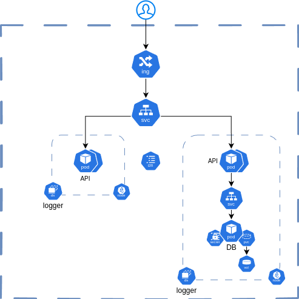

# Mini app con networking básico

En este guía, estaremos configurando una arquitectura básica dentro del cluster. La arquitectura se muestra en el siguiente diagrama:



> [!NOTE]
> A medida que desplegamos componentes vayan mirando que los pods y los otros recursos se estén desplegando bien. Es buena idea tener un watch en una terminal a parte así vamos monitoreando.

Suban con scp la carpeta entera al master.

## 1. Database

Vamos a levantar un postgresql.

### 1.1 Definimos un secret para el user y contraseña

```yaml
apiVersion: v1
kind: Secret
metadata:
  name: postgres-secret
type: Opaque
data:
  username: postgres
  password: secret
```

### 1.2 Definimos un persistent volume

```yaml
apiVersion: v1
kind: PersistentVolume
metadata:
  name: postgres-volume
  labels:
    type: local
    app: postgres
spec:
  storageClassName: manual
  capacity:
    storage: 2Gi
  accessModes:
    - ReadWriteMany
  hostPath:
    path: /data/postgresql
```

También necesitamos un persistent volume claim:

```yaml
apiVersion: v1
kind: PersistentVolumeClaim
metadata:
  name: postgres-volume-claim
  labels:
    app: postgres
spec:
  storageClassName: manual
  accessModes:
    - ReadWriteMany
  resources:
    requests:
      storage: 2Gi
```

### 1.3 Deployment de postgres

Tenemos una única réplica, exponemos el puerto 5432, montamos el volumen y referenciamos el secret para user y password.

```yaml
apiVersion: apps/v1
kind: Deployment
metadata:
  name: postgres-deployment
  labels:
    app: postgres-db
spec:
  replicas: 1
  selector:
    matchLabels:
      app: postgres-db
  template:
    metadata:
      labels:
        app: postgres-db
    spec:
      containers:
        - name: postgres
          image: "postgres:14"
          ports:
            - containerPort: 5432
          env:
            - name: POSTGRES_USER
              valueFrom:
                secretKeyRef:
                  name: postgres-secret
                  key: username
            - name: POSTGRES_PASSWORD
              valueFrom:
                secretKeyRef:
                  name: postgres-secret
                  key: password
          volumeMounts:
            - mountPath: /var/lib/postgresql/data
              name: postgresdata
      volumes:
        - name: postgresdata
          persistentVolumeClaim:
            claimName: postgres-volume-claim
```

### 1.4 Definimos el service

Un [Service](https://kubernetes.io/docs/concepts/services-networking/service/) es el objeto de la API de Kubernetes que describe cómo se accede a las aplicaciones, tal como un conjunto de Pods, y que puede describir puertos y balanceadores de carga.
Con Kubernetes no necesitas modificar tu aplicación para que utilice un mecanismo de descubrimiento de servicios desconocido. Kubernetes le otorga a sus Pods su propia dirección IP y un nombre DNS para un conjunto de Pods, y puede balancear la carga entre ellos.

Para poder comunicarnos con la base vamos a definir un Service utilizando la label del deployment en el selector.

```yaml
apiVersion: v1
kind: Service
metadata:
  name: postgres-db-service
spec:
  selector:
    app: postgres-db
  ports:
    - protocol: TCP
      port: 5432
      targetPort: 5432
```

### Aplicamos los manifests

```bash
kubectl apply -f ./db
```

```bash
kubectl get svc
```

```
NAME                  TYPE        CLUSTER-IP       EXTERNAL-IP   PORT(S)    AGE
...
postgres-db-service   ClusterIP   10.109.162.214   <none>        5432/TCP   9s
```

## 2. API

Vamos a desplegar una mini api en spring boot.

### 2.1 Config

Usamos un configMap para setear como variables de entorno el link a la base de datos (utilizamos el nombre del service que definimos anteriormente) y el LOG LEVEL:

```yaml
apiVersion: v1
kind: ConfigMap
metadata:
  name: api-config
  labels:
    app: api
data:
  DB_URL: jdbc:postgresql://postgres-db-service:5432/postgres
  LOGLEVEL: debug
```

### 2.2 Deployment

Vamos a desplegar 4 replicas del contenedor que se genera a partir del código en `build/spring-boot-simple-user-manager`. Prestemos atención a los detalles como `imagePullPolicy`, `containerPort` y las variables de entorno.

```yaml
apiVersion: apps/v1
kind: Deployment
metadata:
  name: api
  labels:
    app: api
spec:
  replicas: 4
  selector:
    matchLabels:
      app: api
  template:
    metadata:
      labels:
        app: api
    spec:
      containers:
        - name: api
          image: "bsquillari/spring-boot-postgresql:latest"
          imagePullPolicy: IfNotPresent
          ports:
            - containerPort: 8080
          env:
            - name: DB_URL
              valueFrom:
                configMapKeyRef:
                  name: api-config
                  key: DB_URL
            - name: DB_USERNAME
              valueFrom:
                secretKeyRef:
                  name: postgres-secret
                  key: username
            - name: DB_PASSWORD
              valueFrom:
                secretKeyRef:
                  name: postgres-secret
                  key: password
            - name: LOGLEVEL
              valueFrom:
                configMapKeyRef:
                  name: api-config
                  key: LOGLEVEL
```

### 2.3 Service

Ahora definimos el service que va a actuar como capa de abstracción de las 4 instancias de la api:

```yaml
apiVersion: v1
kind: Service
metadata:
  name: api-service
spec:
  selector:
    app: api
  ports:
    - protocol: TCP
      port: 8080
      targetPort: 8080
```

### Aplicamos los manifests

```bash
kubectl apply -f ./api
```

## 3. Ingress

Vamos a definir el punto de entrada al cluster. Para ello, vamos a utilizar un Ingress que por detras va a utilizar un nginx ingress-controller.

### 3.1 Instalamos el ingress-controller

Para que el recurso Ingress funcione, el clúster necesita tener un [ingress-controller](https://kubernetes.io/es/docs/concepts/services-networking/ingress-controllers/) corriendo. Los controladores Ingress no son automáticamente iniciados dentro del clúster. En este caso utilizamos el [NGINX ingress controller](https://www.nginx.com/products/nginx-ingress-controller/).

Corremos desde master (es el script `install-ingress-controller.sh`):

```bash
git clone https://github.com/nginxinc/kubernetes-ingress.git --branch v3.4.3
kubectl apply -f kubernetes-ingress/deployments/common/ns-and-sa.yaml
kubectl apply -f kubernetes-ingress/deployments/rbac/rbac.yaml
kubectl apply -f kubernetes-ingress/deployments/common/nginx-config.yaml
kubectl apply -f kubernetes-ingress/deployments/common/ingress-class.yaml
kubectl apply -f kubernetes-ingress/deployments/deployment/nginx-ingress.yaml
kubectl apply -f https://raw.githubusercontent.com/nginxinc/kubernetes-ingress/v3.4.3/deploy/crds.yaml
kubectl scale --replicas=2 deployment/nginx-ingress -n nginx-ingress
kubectl create -f kubernetes-ingress/deployments/service/nodeport.yaml
```

Si observamos un poco lo que acabamos de correr, vemos que estamos aplicando:

- `ingress-class.yaml` que define una Ingress Class con la que vamos a setear a nuestro ingress para asociarlo al ingress-controller.
- `nginx-ingress.yaml` este es el despliegue del pod del ingress-controller.
- `nodeport.yaml` **creamos un NodePort, el cual será nuestra puerta de acceso al ingress.**

El `nodeport.yaml` es el siguiente:

```yaml
apiVersion: v1
kind: Service
metadata:
  name: nginx-ingress
  namespace: nginx-ingress
spec:
  type: NodePort
  ports:
    - port: 80
      targetPort: 80
      protocol: TCP
      name: http
    - port: 443
      targetPort: 443
      protocol: TCP
      name: https
  selector:
    app: nginx-ingress
```

Es un servicio que va a exponer los puertos 80 para http y 443 para https en todos los nodos.

```bash
kubectl get svc -n nginx-ingress
```

```
NAME            TYPE       CLUSTER-IP      EXTERNAL-IP   PORT(S)                      AGE
nginx-ingress   NodePort   10.99.126.128   <none>        80:32158/TCP,443:32671/TCP   88m
```

```bash
kubectl get pods -n nginx-ingress
```

```
NAME                             READY   STATUS    RESTARTS   AGE   IP               NODE     NOMINATED NODE   READINESS GATES
nginx-ingress-755bf8968b-lf65g   1/1     Running   0          88m   192.168.84.141   node-1   <none>           <none>
nginx-ingress-755bf8968b-qwzmc   1/1     Running   0          48s   192.168.247.21   node-2   <none>           <none>
```

### 3.2 Creamos nuestro Ingress

Un [Ingress](https://kubernetes.io/es/docs/concepts/services-networking/ingress/) es un objeto de la API que administra el acceso externo a los servicios en un clúster, típicamente HTTP. Podría proveer balanceo de cargas, terminación SSL y hosting virtual basado en nombres.

Levantamos un Ingress que va a manejar el acceso externo al servicio api-service:

```yaml
apiVersion: networking.k8s.io/v1
kind: Ingress
metadata:
  name: nginx-ingress
spec:
  ingressClassName: nginx
  tls:
    - hosts:
        - example.com
      secretName: example-com-tls
  rules:
    - host: example.com
      http:
        paths:
          - path: /users
            pathType: Prefix
            backend:
              service:
                name: api-service
                port:
                  number: 8080
```

```bash
kubectl apply -f ./ingress/ingress.yaml
```

```bash
kubectl get ingress
```

```
NAME            CLASS   HOSTS         ADDRESS   PORTS     AGE
nginx-ingress   nginx   example.com             80, 443   12s
```

## 4. Monitoring

### 4.1 Creamos un namespace monitoring

```yaml
apiVersion: v1
kind: Namespace
metadata:
  name: monitoring
```

### 4.2 Levantamos un DaemonSet para acceder a la carpeta de logs

```yaml
apiVersion: apps/v1
kind: DaemonSet
metadata:
  name: logger
  namespace: monitoring
  labels:
    app: logger
spec:
  selector:
    matchLabels:
      name: logger
  template:
    metadata:
      labels:
        name: logger
    spec:
      containers:
        - name: logger
          image: busybox
          command: ["sleep", "infinity"]
          volumeMounts:
            - name: varlog
              mountPath: /var/log
      volumes:
        - name: varlog
          hostPath:
            path: /var/log
```

### Aplicamos los manifests

```bash
kubectl apply -f ./monitoring
```

## Pruebas

Vamos a necesitar los IP de los workers. Para no estar copiando y pegando:
```bash
export NODE1=<COMPLETAR_CON_IP_WORKER1>
export NODE2=<COMPLETAR_CON_IP_WORKER2>
```

### Le pegamos a la API

Para pegarle a la API vamos a utilizar el servicio de NodePort del ingress-controller. Entonces, obtenemos el puerto que expone el servicio:

```bash
kubectl get svc -n nginx-ingress
```

```bash
NAME            TYPE       CLUSTER-IP      EXTERNAL-IP   PORT(S)                      AGE
nginx-ingress   NodePort   10.99.126.128   <none>        80:32158/TCP,443:32671/TCP   95m
```

En este caso, el puerto de http es el `32158`. Definimos:
```bash
export NODEPORT=<COMPLETAR>
```

La API tiene los métodos GET, POST y DELETE en el endpoint '/users' y '/users/{id}'. Creamos un user:

```bash
curl -H "Host: example.com" -H "Content-Type: application/json" -d '{"email":"ricardo@gmail.com", "name":"Juan Carlos II"}' http://${NODE1}:${NODEPORT}/users -X POST
```

Notemos que le podemos pegar a cualquiera de los dos workers. Lo podemos correr varias veces para crear más de un user.

Si hacemos un get vamos a obtener los users:

```bash
curl -H "Host: example.com" http://${NODE2}:${NODEPORT}/users
```

### Balanceo de cargas

Observemos el balanceo de carga entre las instancias de la api. Primero vamos a hacer varios GET requests:

```bash
for i in {1..30}; do curl -q -H 'Host: example.com' ${NODE1}:${NODEPORT}/users > /dev/null 2> /dev/null; done;
```
```bash
for i in {1..30}; do curl -q -H 'Host: example.com' ${NODE2}:${NODEPORT}/users > /dev/null 2> /dev/null; done;
```

Ahora vamos a ver que pods respondieron estos requests:
```bash
kubectl get pods -o wide | grep api | cut -f 1 -d ' ' | xargs -I '{}' sh -c "kubectl logs {} > {}.log" | grep GET *.log
```

A partir de los logs de cada pod, podemos ver que los requests se distribuyeron.

## Desafió

Ahora se quiere agregar una interfaz para gestionar los usuarios. Reciben un proyecto React y tienen que levantar el servicio del cliente en el cluster. El proyecto se encuentra en `build/client`.

El cliente lo queremos en el path `/`. Por algunas restricciones no es fácil de probar en un browser, vamos a probarlo con un `curl`.

```bash
curl -H "Host: example.com" http://${NODE2}:${NODEPORT}/
```
La salida esperada es:
```
<!doctype html><html lang="en"><head><meta charset="utf-8"/><link rel="icon" href="/favicon.ico"/><meta name="viewport" content="width=device-width,initial-scale=1"/><meta name="theme-color" content="#000000"/><meta name="description" content="Web site created using create-react-app"/><link rel="apple-touch-icon" href="/logo192.png"/><link rel="manifest" href="/manifest.json"/><title>React App</title><script defer="defer" src="/static/js/main.0ec55b66.js"></script><link href="/static/css/main.6077ea8b.css" rel="stylesheet"></head><body><noscript>You need to enable JavaScript to run this app.</noscript><div id="root"></div></body></html>
```


