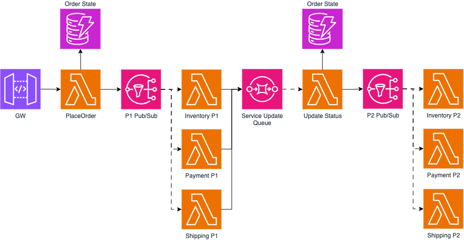

# Serverless

Este es un proyecto en Terraform que levanta lo necesario para correr el patrón de Two-Phase Commit (2PC) en AWS utilizando componentes serverless. Como se muestra en el siguiente diagrama:




## Requisitos

Antes de comenzar, asegúrate de tener instalados los siguientes requisitos:

1. **Terraform**: Puedes descargar e instalar Terraform desde la [página oficial de Terraform](https://www.terraform.io/downloads.html).
2. **AWS CLI**: Necesitarás la AWS CLI configurada con tus credenciales de AWS. Puedes seguir las instrucciones de instalación y configuración en la [guía oficial de AWS CLI](https://docs.aws.amazon.com/cli/latest/userguide/cli-configure-quickstart.html).
3. **Cuenta de AWS**: Una cuenta activa de AWS donde se desplegarán los recursos.

## Instalación

Sigue estos pasos para configurar y ejecutar el proyecto:

1. Inicializá Terraform:
    ```bash
    terraform init
    ```
2. Revisá el plan de ejecución:
    ```bash
    terraform plan
    ```
3. Aplicá el plan para crear la infraestructura:
    ```bash
    terraform apply
    ```
Se te pedirá que confirmes la aplicación del plan. Escribí yes y presiona Enter.

## Notas

- El API GW en el diagrama es representativo. El proyecto no tiene origen de los mensajes ya que se puede integrar con otros servicios o inclusive correr una prueba desde la consola de lambda.
- Las lambdas escriben logs a cloud watch que sirven para observar el correcto funcionamiento del sistema.
